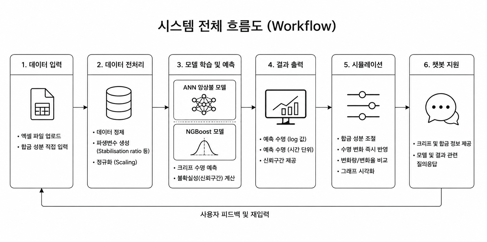

# 🧪 Material Parts Life Prediction

### 소재부품 수명 예측 및 설계 지원 AI 시스템

## 👥 Team 올클

강다영 · 이혜원 · 최지호

---

## 📌 Project Overview

고온·고압 환경에서 사용되는 내열강 및 초내열합금의
**크립 수명(Creep Life)을 예측하는 AI 기반 시스템**을 구현한 프로젝트.

합금 성분, 온도, 응력 등의 데이터를 입력하면 수명을 예측하고,
성분을 직접 조절하면서 수명 변화를 확인할 수 있는
**시뮬레이션 기능까지 포함한 형태로 개발했다.**

또한 실제 데이터 환경을 고려해서
엑셀 컬럼 순서나 일부 값이 달라도 자동으로 정리되도록 구현했다.

---

## 🔄 Workflow



## ⚙️ Tech Stack

* Python
* TensorFlow / Keras (ANN 앙상블 모델)
* NGBoost (불확실성 분석)
* Pandas / NumPy / Scikit-learn
* Matplotlib
* Streamlit

---

## 🚀 Key Features

* **수명 예측**
  → 합금 성분 및 조건 기반 크립 수명 예측

* **불확실성 분석**
  → NGBoost로 신뢰구간 제공

* **데이터 자동 처리**
  → 컬럼 순서 및 누락 데이터 자동 정리

* **실제 시간 변환**
  → log10 결과를 hour 단위로 변환

* **합금 시뮬레이션**
  → 성분 변경 시 수명 변화 확인

* **결과 비교 및 시각화**
  → 기존 vs 변경 값 그래프로 비교

* **AI Assistant**
  → 기본 개념 설명 (키워드 기반 챗봇)

---

## ▶️ How to Run

```bash
pip install -r requirements.txt
streamlit run app.py
```

**사용 순서**

1. Data Upload → 엑셀 업로드
2. Prediction 실행
3. Result에서 결과 확인
4. Simulation으로 성분 변경 테스트

---

## 📊 Result

* ANN 앙상블 → 높은 예측 정확도
* NGBoost → 불확실성까지 함께 제공
* 다양한 형태의 데이터에서도 안정적으로 동작

---

## 🧠 Summary

👉 예측 + 불확실성 + 시뮬레이션까지 가능한 통합 AI 시스템
